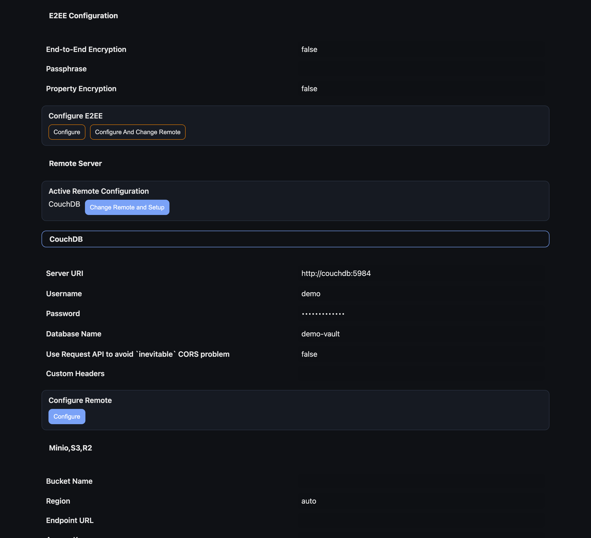
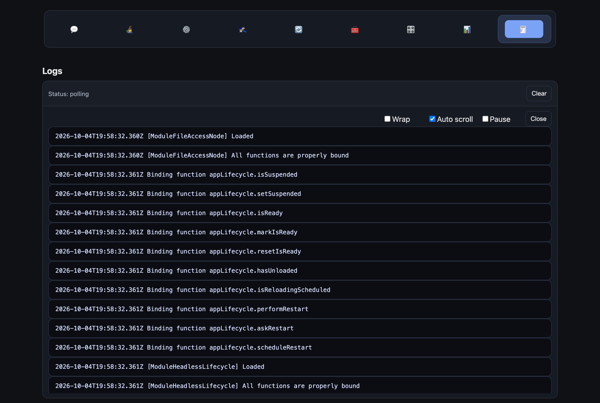

# Headless LiveSync

A fork of [Self-hosted LiveSync](https://github.com/vrtmrz/obsidian-livesync) that adds a **headless daemon**: a Node.js process that keeps a plain folder on a server in sync with your Obsidian vault, without Obsidian running there, and a **web UI** to configure and watch it.




| | |
|---|---|
| **Status** | Experimental. A first version, not worked through enough for active use. |
| **Last worked on** | December 2025 |
| **Based on** | Self-hosted LiveSync 0.25.36; upstream has moved on considerably since |
| **Builds from a clean clone** | No — see [Current state](#current-state) |
| **Upstream** | [vrtmrz/obsidian-livesync](https://github.com/vrtmrz/obsidian-livesync) by vorotamoroz |

## What it is for

Self-hosted LiveSync synchronises an Obsidian vault between devices through a CouchDB database you host yourself. Every device runs the plug-in inside Obsidian and holds a full copy of the vault; the copies converge over time as changes replicate through CouchDB. It is replication between equals rather than central storage — there is no single master copy, and a device keeps working offline.

That design has one gap: the server only ever holds LiveSync's database documents, never the notes as files. This fork fills it. The headless daemon is one more replica that lives on the server and writes the vault out as an ordinary folder:

```
 Obsidian (laptop) ─┐
 Obsidian (phone)  ─┼──  CouchDB  ──  headless daemon  ──  /vault  (plain files on the server)
 Obsidian (tablet) ─┘
```

With that folder in place, the notes are stored on the server and reachable from every client device, and the server itself can work with them: back them up, index them, run scripts or agents over the Markdown. Anything written into the folder on the server replicates back out to the Obsidian clients.

The daemon speaks the same protocol as the plug-in — same document format, same encryption, same path-to-ID mapping — so existing clients need no changes.

## The web UI

The daemon serves a settings and monitoring UI on port 80, behind HTTP Basic Auth. It reuses the plug-in's own settings panes, running in a browser instead of inside Obsidian, and adds two panes of its own: Dashboard and Logs.

**Settings** — the LiveSync configuration panes, the same ones the plug-in shows in Obsidian: setup wizard, remote server and encryption, sync mode, selectors, maintenance. Prompts the daemon raises while starting up, such as how to apply a new configuration, appear here as dialogs.


**Logs** — the daemon's log, streamed live, with pause and auto-scroll.



**Dashboard** — daemon mode, sync status, queue sizes, the last error, and charts of replication throughput and queue pressure. It is not pictured: until file sync works end to end there is no traffic for the charts to draw.

## What was added to upstream

One commit on top of LiveSync 0.25.36: 64 files, roughly 7,700 lines.

| Area | Where | What |
|---|---|---|
| Daemon | `src/headless/` | Entry point, lifecycle, browser-API polyfills for Node, local PouchDB on LevelDB |
| File access | `src/modules/coreNode/` | Vault storage over the filesystem instead of the Obsidian API; a watcher that detects changes by periodic scan |
| Headless modules | `src/modules/headless/`, `src/modules/services/` | Settings, the CouchDB connector, lifecycle, answering confirmation prompts |
| Web server | `src/headless/web/server.ts` | Static UI plus a small API: settings, metrics, live logs, confirmations |
| Web UI | `src/headless/web/ui/` | Svelte app, shims that stand in for Obsidian in the browser, Dashboard and Logs panes |
| Packaging | `Dockerfile`, `docker-compose.yml`, `example.env.headless` | Container image and compose file |
| Docs | [`docs/headless.md`](docs/headless.md) | Configuration, data flow, limitations, troubleshooting |

About fifteen upstream files were touched lightly so that shared modules no longer assume Obsidian is present.

## Current state

Making LiveSync run headless is a hard problem. The plug-in is written against Obsidian's API and a browser environment throughout, and every piece of that — storage, events, workers, dialogs, settings UI — needs a counterpart on a server. This fork is a first pass at it and stopped there.

What that means in practice, as of the last check in October 2026:

- **It does not build from a clean clone.** The shared library imports a web worker (`bg.worker.ts?worker`) that neither the UI build nor the Node runtime can load. Both need the library's in-thread mock substituted for it; that substitution is not in the repository.
- **With the worker substituted, the daemon starts and the UI works.** It connects to CouchDB, walks through the startup prompts, and reaches the running state. The screenshots above were taken this way.
- **End-to-end file sync is not verified.** In that same run, storing local files into the database failed. Whether that is the missing worker or a defect in the port has not been established.
- **The watcher polls** the vault folder instead of using filesystem events.
- **Dashboard charts render imperfectly** and, without working file sync, have no data to show.
- **There are no tests** for the headless code.
- **Upstream is far ahead.** The fork has not been rebased since 0.25.36.

Do not point this at a vault you care about.

## Running it

For the record of how it is meant to work — see [Current state](#current-state) before trying.

```sh
git clone --recurse-submodules https://github.com/efim0v/headless-obsidian-livesync.git
cd headless-obsidian-livesync
# put or mount your vault at ./my-vault, then:
docker compose up --build
```

The UI is then at <http://localhost/>, with the user and password set by `LIVESYNC_UI_USER` and `LIVESYNC_UI_PASS` in `docker-compose.yml`. Full configuration is described in [`docs/headless.md`](docs/headless.md).

## Upstream

Everything else in this repository is Self-hosted LiveSync by [vorotamoroz](https://github.com/vrtmrz) and its contributors, under the MIT license. Its original README is kept as [`README_upstream.md`](README_upstream.md); for the plug-in itself, use the [upstream repository](https://github.com/vrtmrz/obsidian-livesync).
